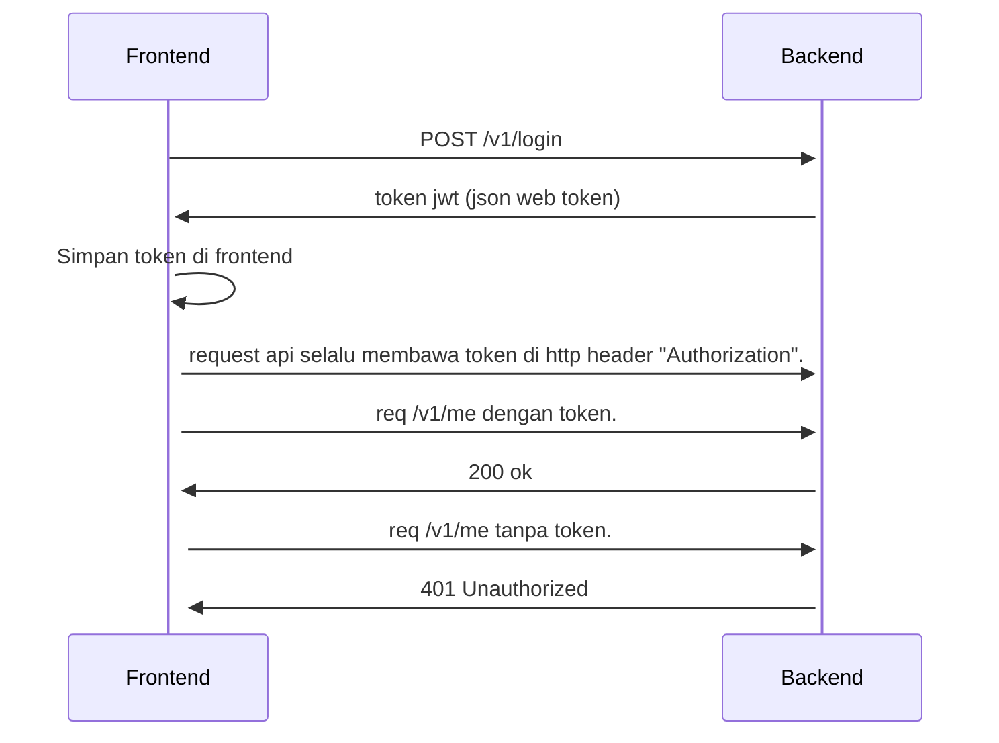

# Mulai Ulang Buat Authentifikasi Sendiri.

## REST API Login.

1. buat rest api login.<br>
    route:
    - `/v1/login` dengan method `GET` sama `POST`<br>
        payload:
        ```
        {
            "username": "contoh",
            "password": "contohpassword",
        }
        ```
        response:
        ```
        {
            "token": "jsonwebtokengenerated"
        }
        ```
    - `/v1/me` dengan method `GET`

2. tentunya paka format `json`.
3. authentifikasi menggunakan `JSON Web Token`.

## REST API User.

1. buat rest api register.<br>
    route:
    - `/v1/register`


## Ketentuan Backend.
1. database yg digunakan harus postgres.
2. data user harus menggunakan database.
3. rest api boleh ditulis menggunakan javascript atau golang.

## Flow Authentifikasi.


# Review Project.
Setiap aplikasi web gudang itu harus punya:
1. Manajemen produk, `create`, `update`, `read` dan `delete`
2. Manajemen stock, `create`, `update`, `read` dan `delete`
3. Manajemen user, `create`, `update`, `read` dan `delete`

